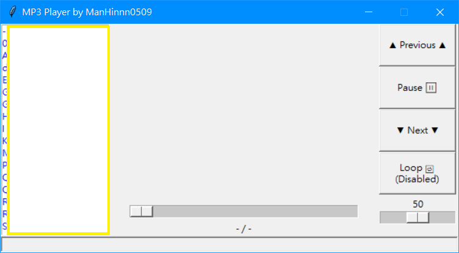
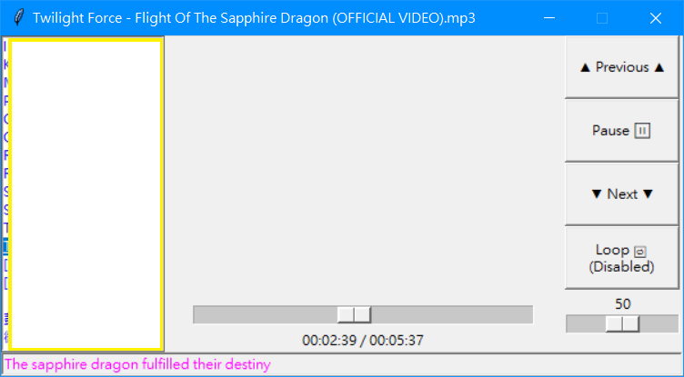

# mp3player.py

MP3 Player with Tkinter and Pygame in Python

**This is created for fun.** Also because all the .mp3 players I have has the same issue, high CPU and RAM usage.

So I decided to create my own so that I can listen to music while I'm gaming without lag

P.S: **I'm not professional with Tkinter / Pygame. And I'm bad at UI designing :P**

## Demo (Images)

### Default



### Playing



## Setup

Create a `.env` file and put the path to the `.mp3` files directory into it. Like this:
```
MP3_FOLDER_PATH=THE_PATH/TO/THE/MP3_FILES/DIRECTORY
```

## Requirements

See [requirements.txt](./requirements.txt)

## To start the player

Actually just run the `main.py` or `v1/main_v1.py` will do the job

I added `.bat` file for quick restart which is for debugging and developing

## Functions

### Songs list

* Lists all `.mp3` files found in given directory
* Supports scrolling
* Double click to play selected song
* [Right click to refresh song list](https://github.com/ManHinnn0509/mp3player.py/commit/3f896194fb64d67dd0d8d6dd19004799a69aa0c8)

### Volume control

* From 0 ~ 100
* Located in the right bottom corner

### Previous / Next button

* Click to play previous / next song

### Pause / resume button

* Pause / resume playing

### Loop enabling / disabling button

* You can enable / disable looping anytime you want

### Time position control

* Located in the middle (bottom)
* You can drag it to control time position
* Displays current time position & song length

### Lyrics display

* Only support `.lrc` file
* Only `offset` meta data is supported (Both + / - in **ms**)
* `.lrc` file name has to be the same as the `.mp3` file and in the same directory as the `.mp3` file does
* [~~The time might not be very accurate since `round()` is being used in parsing~~](https://github.com/ManHinnn0509/mp3player.py/issues/5)
* [Examples here](./lrc_examples)

## LRC Creator / Editor

I tried [this editor](https://lrc-maker.github.io/) and it's easy to use and works like a charm

## Planned

* [x] [Add time control (Time slider?)](https://github.com/ManHinnn0509/mp3player.py/commit/6ec3a412478984309697aeb6518540c91b4c5288)
* [x] Add more comment for the codes (Added in current version)
* [x] **Rework with better and clearer code** (Moved old codes into [`v1`](./v1) dir)
* [x] [Lyrics display (.lrc file) with status bar](https://github.com/ManHinnn0509/mp3player.py/commit/ef7008d8f7ee91b4f41f9165b0ad2e7c76c3995d)
* [ ] ~~Add lyrics display (Maybe LRC File? [維基][zh_wiki_lrc] / [wiki][en_wiki_lrc])~~
* [x] [~~Random song button~~](https://github.com/ManHinnn0509/mp3player.py/commit/9fc4c2ff9548d4ff56fc15cc8c81479838d8cb8a)
* [ ] Play next song automatically after the current one ends
* [ ] Press `M` to mute / unmute

## Known issues

* Might unable to load some .mp3 files (Due to encoding issue?)
* See [Issues][issues]

[issues]: https://github.com/ManHinnn0509/mp3player.py/issues

[zh_wiki_lrc]: https://zh.wikipedia.org/wiki/LRC%E6%A0%BC%E5%BC%8F
[en_wiki_lrc]: https://en.wikipedia.org/wiki/LRC_%28file_format%29
